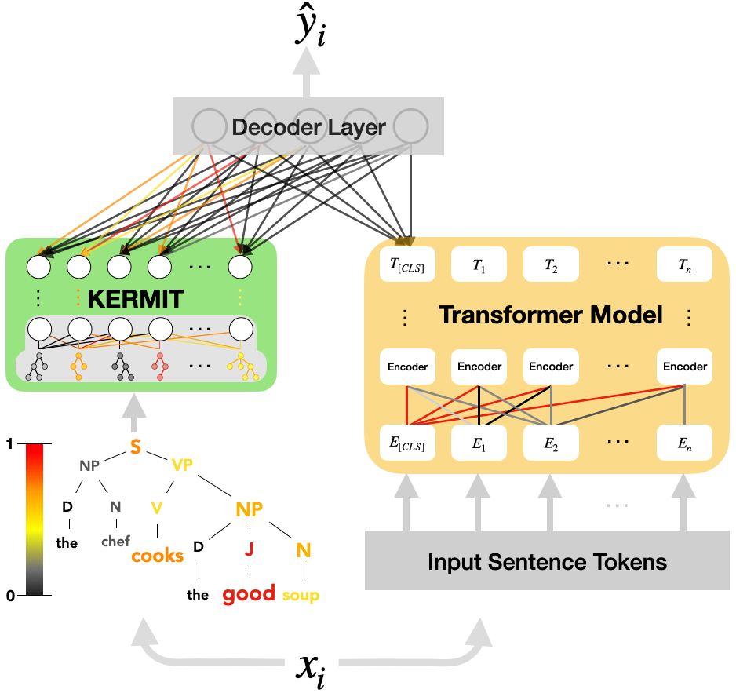

# 🐸 KERMIT

KERMIT is a lightweight Python library to **encode** and **interpret** *Universal Syntactic Embeddings*

**Paper**: https://www.aclweb.org/anthology/2020.emnlp-main.18/

**Presentation**: https://slideslive.com/38938864



Project Organization
------------

    |
    ├── /examples                        <- Folder containing some KERMIT examples
    │   └── /Notebooks       
    |       ├── /scripts                 <- Folder containing some scripts for our examples
    |       ├── KERMIT_encoder.ipynb     <- Jupyter Notebook for saving the KERMIT encoded trees
    |       ├── KERMIT_training.ipynb    <- Jupyter Notebook for training a system with KERMIT
    |       ├── KERMITviz.ipynb          <- Jupyter Notebook for visualizing KERMIT's heat parse trees
    |       ├── KERMITviz_Colab.ipynb    <- Jupyter Notebook for visualizing KERMIT's heat parse trees on Colab
    |       └── README.md                <- Readme file that introduces the example notebooks
    |
    ├── /kerMIT                          <- Folder containing the Python KERMIT library
    ├── /img                             <- Folder containing the images for this README file
    ├── LICENSE                          <- License file
    └── README.md                        <- This Readme file
     
--------

# Why should I use KERMIT?

- KERMIT can be used to enhance Transformers' performance on various linguistic tasks adding relevant syntactic information from parse trees
- It is lightweight compared to a Transformer model
- KERMIT decision can be interpreted using this library and it is possible to visualize heat parse trees.

# Installation
```
git clone https://github.com/ART-Group-it/KERMIT.git 
pip install ./KERMIT/kerMIT
```
# Usage

## Demo Notebooks

- **KERMIT encoder** - Build syntactic input from a custom dataset [notebook 1](https://github.com/ART-Group-it/KERMIT/blob/master/examples/Notebooks/KERMIT_encoder.ipynb).

- **KERMIT + BERT mode**l - Train the model and save the weights [notebook 2](https://github.com/ART-Group-it/KERMIT/blob/master/examples/Notebooks/KERMIT_training.ipynb).

- **KERMITviz** - Visualize how much the syntax affects the final choice of the model [notebook 3](https://github.com/ART-Group-it/KERMIT/blob/master/examples/Notebooks/KERMITviz.ipynb) or [](https://colab.research.google.com/github/ART-Group-it/KERMIT/blob/master/examples/Notebooks/KERMITviz_Colab.ipynb)

- **New Version KERMITviz** - Visualize how much the syntax affects the final choice of the model [notebook 3](https://github.com/ART-Group-it/KERMIT/blob/master/examples/Notebooks/KERMITviz.ipynb) or [](https://colab.research.google.com/github/ART-Group-it/KERMIT/blob/master/examples/Notebooks/KERMITviz__.ipynb)

## Quickstart with KERMIT encoder
```
from kerMIT.tree import Tree
from kerMIT.dtk import DT
from kerMIT.operation import fast_shuffled_convolution

your_parse_tree = "(A (B C))" #Insert here your parsed tree in parenthetical format
tree = Tree(string=your_parse_tree)
kermit_encoder = DT(dimension=8192, LAMBDA= 0.6, operation=fast_shuffled_convolution)

kermit_tree_encoded = kermit_encoder.dt(tree)

>> array([-0.00952759,  0.02018453, -0.02713741, ...,  0.00362533])
```
## Need help?
If you are stuck, need help, or find a bug, let us know and open an issue here on Github!

# Citation
If you use this code, please cite the paper:
```
@inproceedings{zanzotto-etal-2020-kermit,
    title = "{KERMIT}: Complementing Transformer Architectures with Encoders of Explicit Syntactic Interpretations",
    author = "Zanzotto, Fabio Massimo  and
      Santilli, Andrea  and
      Ranaldi, Leonardo  and
      Onorati, Dario  and
      Tommasino, Pierfrancesco  and
      Fallucchi, Francesca",
    booktitle = "Proceedings of the 2020 Conference on Empirical Methods in Natural Language Processing (EMNLP)",
    month = nov,
    year = "2020",
    address = "Online",
    publisher = "Association for Computational Linguistics",
    url = "https://www.aclweb.org/anthology/2020.emnlp-main.18",
    pages = "256--267",
}
```

